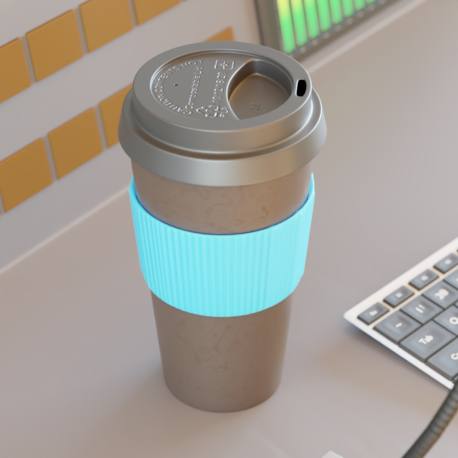

# 3DMonitorRoom
> Monitor Room made in Blender 2.81

# Demo Video

# Renders
## 4K Render

## 1080p Render w/o walls and w/ HDR

## Cup

## Camera Controller

# Sources/Credits

Mouse: https://www.blendswap.com/blends/view/61128

Chair: https://www.blendswap.com/blends/view/56033

Switch: https://www.blendswap.com/blend/18752

Concrete material: https://gumroad.com/juliosillet

Tears of Steel: https://mango.blender.org/

HDR: http://www.hdrlabs.com/sibl/archive.html

RGB pattern for monitors by Jonathan Kron
